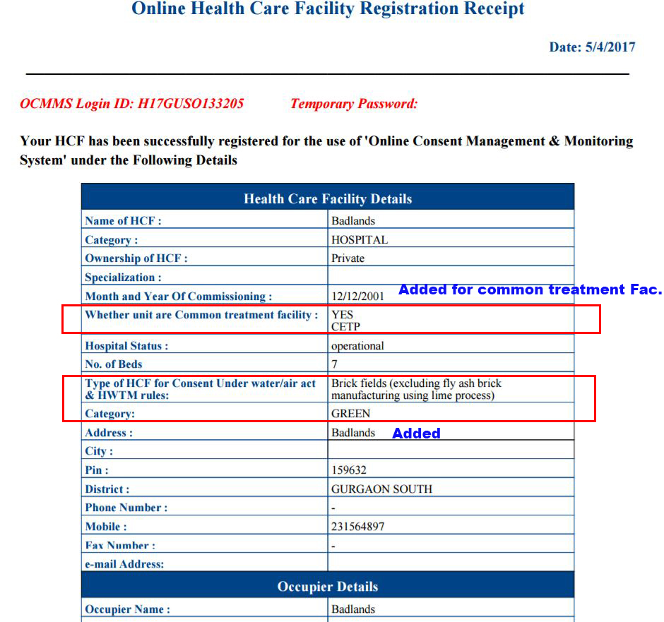

Common treatment facility added in industry registration
========================================================

1. inside grails-app/views/industryRegMaster/create1.gsp
	hideshow() is not calling properly so comments - changes by vineeta removed

2. In grails-app/views/industryRegMaster/create1.gsp
	
	search for
	bhanu code start; date: 31-03-2017

3. in IndustryRegMasterController.groovy
	action: save1
		search for
		bhanu code start; date: 31-03-2017

4. in grails-app/views/industryRegMaster/show1.gsp
	search for
	bhanu code start; date: 31-03-2017

5. IndustryRegMaster.groovy
	search for
	bhanu code start; date: 31-03-2017

6. grails-app/views/industryRegMaster/edit.gsp
	search for 
	bhanu code start; date: 03-04-2017

7. industryRegMasterController
	search for 
	bhanu code start;

	made changes in action: update and action: save1

8. IndustryRegMaster.groovy
	bhanu code start; date: 31-03-2017

	two columns added
	update them in database

If user apply for Less than 20 bed then 'Type of HCF for consent under water/air act and
HWTM rules' need to view and its category type also.
-----------------------------------------------------------------------------------------------

1. grails-app/views/industryRegMaster/create1.gsp
	
	Search for 
	bhanu code start; date: 05-04-2017

	changes made in function hideShowBedTextArea(){}

2. grails-app/views/industryRegMaster/edit.gsp

	Search for 
	bhanu code start; date: 05-04-2017

	changes made in function hideShowBedTextArea(){}

3. IndProfilePdf.java
	in function indProfileFunction

	serach for bhanu code start; date: 05-04-2017

4. IndustryRegMasterController.groovy
	
	search for
	bhanu code start; date: 05-04-2017

Images
------

1. Click on registration link

.. image:: images/common_treatment_facility/001.JPG

2. Registration page for HSF

	Requirement specified on mail dated 22-March-2017
	1. If user apply for Less than 20 bed then "Type of HCF for consent under water/air act &
HWTM rules" need to view and its category type also.

	2. "Whether unit are Common treatment facility" with dropdown  "Yes" and "No" option is
required. If user chose &quot;Yes&quot; then in drop down these options are required:
STP, CETP,CBWTF, E-waste Dismantle/recycler/ collection center , Used oil refinery, Hazardous
waste/TSDF, Battery recycler, plastic recycler required in all forms.	

.. image:: images/common_treatment_facility/002.JPG

3. Show page

4. Pdf 

