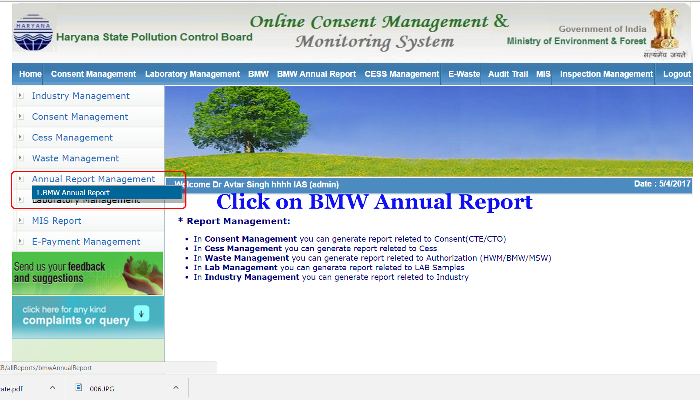
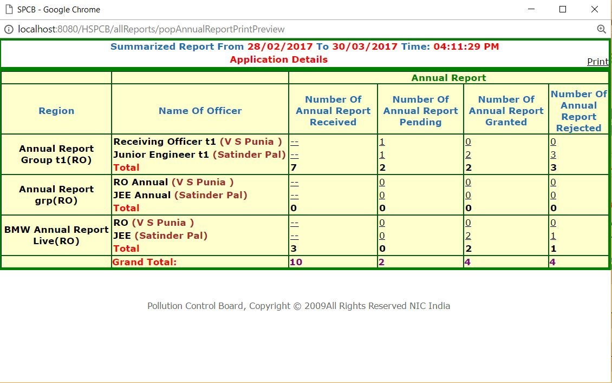
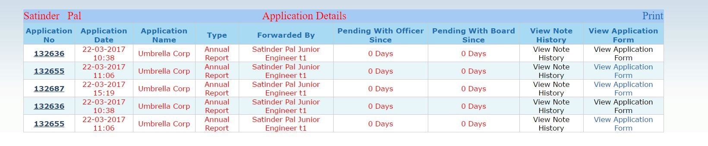

MIS Annual Report Procedure
===========================

Step 1: Login with admin 
------------------------
	
login with admin user id and password

Step 2: Click on MIS At horizontal menu
---------------------------------------

Step 3: Hover Annual Report Management and click 4. BMW Annual Report
-------------------------------------------------------------

Step 4: Select 'start date' and 'end date' and click search
-----------------------------------------------------------

.. image:: images/MIS_Annual_Report_Procedure/004.JPG

Step 5: View Search Result
--------------------------

Step 6: Click on print preview
------------------------------

A popup window will open and on clicking the resulting report can be printed

Step 7: Click on either number of Annual Report - received, pending, granted, rejected
--------------------------------------------------------------------------------------

